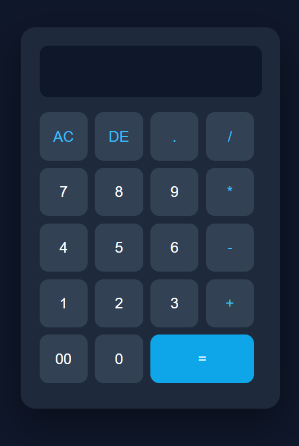

# 🧮 Calculator

A simple, responsive calculator built using HTML, CSS, and JavaScript.

## 📌 Overview

This project is a frontend calculator designed to perform basic
arithmetic operations through a clean and user-friendly interface.

It was created as a beginner web development project to practice
HTML, CSS, and JavaScript fundamentals.

## ✨ Features

- Addition
- Subtraction
- Multiplication
- Division
- Decimal calculations
- Clear (AC) button
- Delete (DE) button
- Responsive design
- Modern user interface
- Button hover and click effects

## 🛠️ Technologies Used

- HTML5
- CSS3
- JavaScript

## 📸 Screenshot



## 🚀 Getting Started

### Clone the repository

```bash
git clone https://github.com/AayushPatel018/Simple-Calculator-Using-HTML-CSS.git